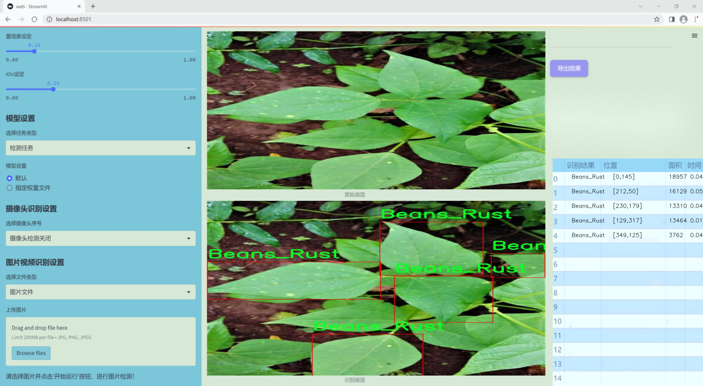
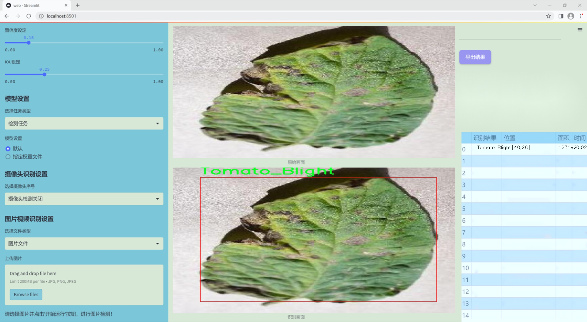
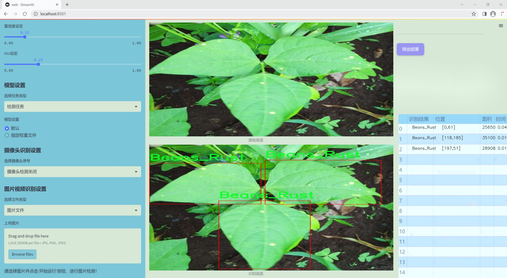
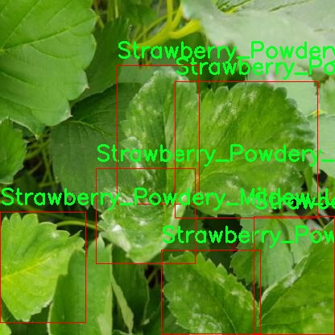
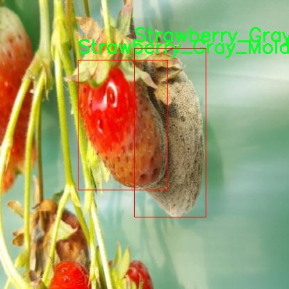
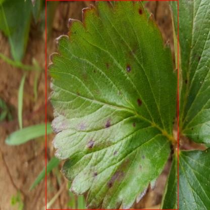
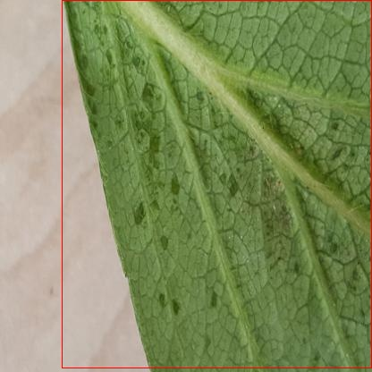
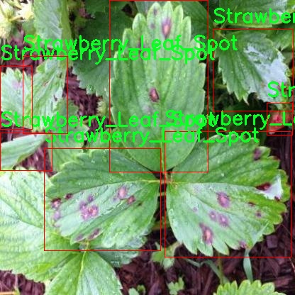

# 改进yolo11-AKConv等200+全套创新点大全：农业病害检测系统源码＆数据集全套

### 1.图片效果展示







##### 项目来源 **[人工智能促进会 2024.10.24](https://kdocs.cn/l/cszuIiCKVNis)**

注意：由于项目一直在更新迭代，上面“1.图片效果展示”和“2.视频效果展示”展示的系统图片或者视频可能为老版本，新版本在老版本的基础上升级如下：（实际效果以升级的新版本为准）

  （1）适配了YOLOV11的“目标检测”模型和“实例分割”模型，通过加载相应的权重（.pt）文件即可自适应加载模型。

  （2）支持“图片识别”、“视频识别”、“摄像头实时识别”三种识别模式。

  （3）支持“图片识别”、“视频识别”、“摄像头实时识别”三种识别结果保存导出，解决手动导出（容易卡顿出现爆内存）存在的问题，识别完自动保存结果并导出到tempDir中。

  （4）支持Web前端系统中的标题、背景图等自定义修改。

  另外本项目提供训练的数据集和训练教程,暂不提供权重文件（best.pt）,需要您按照教程进行训练后实现图片演示和Web前端界面演示的效果。

### 2.视频效果展示

[2.1 视频效果展示](https://www.bilibili.com/video/BV15f1YYrEBG/)

### 3.背景

研究背景与意义

随着全球人口的持续增长和城市化进程的加快，农业生产面临着越来越大的压力。病害是影响农作物产量和质量的重要因素，及时准确地检测和识别病害对于保障农业生产、提高农作物产量具有重要意义。近年来，计算机视觉和深度学习技术的快速发展为农业病害检测提供了新的解决方案。其中，YOLO（You Only Look Once）系列模型因其高效的实时目标检测能力，逐渐成为农业病害检测领域的研究热点。

本研究旨在基于改进的YOLOv11模型，构建一个高效的农业病害检测系统。该系统将利用一个包含5500张图像的数据集，涵盖12种不同类型的农作物病害，包括豆类、草莓和番茄等常见作物的病害。这些病害的种类多样，涉及到不同的生物特征和生长环境，因此，对其进行准确的检测和分类将有助于农民及时采取相应的防治措施，降低病害对作物的影响。

在现有的农业病害检测研究中，尽管已有多种深度学习模型被提出，但仍存在检测精度不足、实时性差等问题。通过对YOLOv11模型的改进，我们希望能够提升模型在复杂背景下的检测能力，并增强其对不同病害的识别准确性。此外，利用丰富的标注数据集，我们将进行模型的训练和验证，以确保其在实际应用中的有效性和可靠性。

综上所述，本研究不仅为农业病害检测提供了一种新的技术路径，也为农民提供了更为高效的病害管理工具，具有重要的理论价值和实际应用意义。通过实现高效、准确的病害检测，我们期待能够为农业可持续发展贡献一份力量。

### 4.数据集信息展示

##### 4.1 本项目数据集详细数据（类别数＆类别名）

nc: 12
names: ['Beans_Angular_LeafSpot', 'Beans_Rust', 'Strawberry_Angular_LeafSpot', 'Strawberry_Anthracnose_Fruit_Rot', 'Strawberry_Blossom_Blight', 'Strawberry_Gray_Mold', 'Strawberry_Leaf_Spot', 'Strawberry_Powdery_Mildew_Fruit', 'Strawberry_Powdery_Mildew_Leaf', 'Tomato_Blight', 'Tomato_Leaf_Mold', 'Tomato_Spider_Mites']


该项目为【目标检测】数据集，请在【训练教程和Web端加载模型教程（第三步）】这一步的时候按照【目标检测】部分的教程来训练

##### 4.2 本项目数据集信息介绍

本项目数据集信息介绍。本项目所使用的数据集名为“Detecting diseases”，旨在为改进YOLOv11的农业病害检测系统提供强有力的支持。该数据集包含12个不同的类别，涵盖了多种农作物的病害，具体包括：豆类的角斑病、锈病，以及草莓的多种病害，如角斑病、果腐病、花朵枯萎病、灰霉病、叶斑病和粉霉病。此外，数据集中还包括西红柿的病害，如枯萎病、叶霉病和蜘蛛螨的影响。这些类别的选择不仅反映了当前农业生产中常见的病害类型，也为研究人员提供了一个全面的基础，以便于进行深入的分析和模型训练。

数据集中的图像经过精心挑选和标注，确保每个类别的样本具有代表性和多样性。这种多样性对于训练深度学习模型至关重要，因为它能够帮助模型学习到不同病害在不同生长阶段、不同环境条件下的表现特征。通过使用“Detecting diseases”数据集，研究人员能够更好地理解和识别农业病害，从而提高作物的产量和质量。

在数据集的构建过程中，特别注重了图像的质量和标注的准确性，确保每个图像都能清晰地展示出病害的特征。这样的高质量数据集不仅为YOLOv11的训练提供了坚实的基础，也为后续的农业病害检测研究奠定了良好的数据支持。通过对这些数据的深入分析，研究人员希望能够开发出更为精准和高效的病害检测系统，从而为现代农业的可持续发展贡献力量。











### 5.全套项目环境部署视频教程（零基础手把手教学）

[5.1 所需软件PyCharm和Anaconda安装教程（第一步）](https://www.bilibili.com/video/BV1BoC1YCEKi/?spm_id_from=333.999.0.0&vd_source=bc9aec86d164b67a7004b996143742dc)


[5.2 安装Python虚拟环境创建和依赖库安装视频教程（第二步）](https://www.bilibili.com/video/BV1ZoC1YCEBw?spm_id_from=333.788.videopod.sections&vd_source=bc9aec86d164b67a7004b996143742dc)

### 6.改进YOLOv11训练教程和Web_UI前端加载模型教程（零基础手把手教学）

[6.1 改进YOLOv11训练教程和Web_UI前端加载模型教程（第三步）](https://www.bilibili.com/video/BV1BoC1YCEhR?spm_id_from=333.788.videopod.sections&vd_source=bc9aec86d164b67a7004b996143742dc)


按照上面的训练视频教程链接加载项目提供的数据集，运行train.py即可开始训练



     Epoch   gpu_mem       box       obj       cls    labels  img_size
     1/200     20.8G   0.01576   0.01955  0.007536        22      1280: 100%|██████████| 849/849 [14:42<00:00,  1.04s/it]
               Class     Images     Labels          P          R     mAP@.5 mAP@.5:.95: 100%|██████████| 213/213 [01:14<00:00,  2.87it/s]
                 all       3395      17314      0.994      0.957      0.0957      0.0843

     Epoch   gpu_mem       box       obj       cls    labels  img_size
     2/200     20.8G   0.01578   0.01923  0.007006        22      1280: 100%|██████████| 849/849 [14:44<00:00,  1.04s/it]
               Class     Images     Labels          P          R     mAP@.5 mAP@.5:.95: 100%|██████████| 213/213 [01:12<00:00,  2.95it/s]
                 all       3395      17314      0.996      0.956      0.0957      0.0845

     Epoch   gpu_mem       box       obj       cls    labels  img_size
     3/200     20.8G   0.01561    0.0191  0.006895        27      1280: 100%|██████████| 849/849 [10:56<00:00,  1.29it/s]
               Class     Images     Labels          P          R     mAP@.5 mAP@.5:.95: 100%|███████   | 187/213 [00:52<00:00,  4.04it/s]
                 all       3395      17314      0.996      0.957      0.0957      0.0845


###### [项目数据集下载链接](https://kdocs.cn/l/cszuIiCKVNis)

### 7.原始YOLOv11算法讲解


##### YOLO11介绍

Ultralytics YOLO11是一款尖端的、最先进的模型，它在之前YOLO版本成功的基础上进行了构建，并引入了新功能和改进，以进一步提升性能和灵活性。
**YOLO11设计快速、准确且易于使用，使其成为各种物体检测和跟踪、实例分割、图像分类以及姿态估计任务的绝佳选择。**


**结构图如下：**


##### **C3k2**

**C3k2，结构图如下**


**C3k2，继承自类`C2f，其中通过c3k设置False或者Ture来决定选择使用C3k还是`**Bottleneck


**实现代码** **ultralytics/nn/modules/block.py**

##### C2PSA介绍

**借鉴V10 PSA结构，实现了C2PSA和C2fPSA，最终选择了基于C2的C2PSA（可能涨点更好？）**


**实现代码** **ultralytics/nn/modules/block.py**

##### Detect介绍

**分类检测头引入了DWConv（更加轻量级，为后续二次创新提供了改进点），结构图如下（和V8的区别）：**


### 8.200+种全套改进YOLOV11创新点原理讲解

#### 8.1 200+种全套改进YOLOV11创新点原理讲解大全

由于篇幅限制，每个创新点的具体原理讲解就不全部展开，具体见下列网址中的改进模块对应项目的技术原理博客网址【Blog】（创新点均为模块化搭建，原理适配YOLOv5~YOLOv11等各种版本）

[改进模块技术原理博客【Blog】网址链接](https://gitee.com/qunmasj/good)


#### 8.2 精选部分改进YOLOV11创新点原理讲解

###### 这里节选部分改进创新点展开原理讲解(完整的改进原理见上图和[改进模块技术原理博客链接](https://gitee.com/qunmasj/good)【如果此小节的图加载失败可以通过CSDN或者Github搜索该博客的标题访问原始博客，原始博客图片显示正常】


### OREPA：在线卷积重参数化
卷积神经网络(CNNs)已经在许多计算机视觉任务的应用成功，包括图像分类、目标检测、语义分割等。精度和模型效率之间的权衡也已被广泛讨论。

一般来说，一个精度较高的模型通常需要一个更复杂的块，一个更宽或更深的结构。然而，这样的模型总是太重，无法部署，特别是在硬件性能有限、需要实时推理的场景下。考虑到效率，更小、更紧凑和更快的模型自然是首选。

为了获得一个部署友好且高精度的模型，有研究者提出了基于结构重参数化的方法来释放性能。在这些方法中，模型在训练阶段和推理阶段有不同的结构。具体来说，使用复杂的训练阶段拓扑，即重参数化的块，来提高性能。训练结束后，通过等效变换将一个复杂的块重参为成一个单一的线性层。重参后的模型通常具有一个整洁架构模型，例如，通常是一个类似VGG的或一个类似ResNet的结构。从这个角度来看，重参化策略可以在不引入额外的推理时间成本的情况下提高模型的性能。


BN层是重构模型的关键组成部分。在一个重新解析块(图1(b))中，在每个卷积层之后立即添加一个BN层。可以观察到，去除这些BN层会导致的性能退化。然而，当考虑到效率时，这种BN层的使用出乎意料地在训练阶段带来了巨大的计算开销。在推理阶段，复杂的块可以被压缩成一个卷积层。但是，在训练过程中，BN层是非线性的，也就是说，它们将特征映射除以它的标准差，这就阻止了合并整个块。因此，存在大量的中间计算操作(large FLOPS)和缓冲特征映射(high memory usage)。更糟糕的是，这么高的训练预算使得很难探索更复杂和可能更强的重参块。很自然地，下面的问题就出现了：

为什么标准化在重参中这么重要？

通过分析和实验，作者认为BN层中的尺度因子最重要，因为它们能够使不同分支的优化方向多样化。

基于观察结果，作者提出了在线重参化(OREPA)(图1(c))，这是一个两阶段的pipeline，使之能够简化复杂的training-time re-param block。

在第一阶段，block linearization，去除所有的非线性BN层，并引入线性缩放层。这些层与BN层具有相似的性质，因此它们使不同分支的优化多样化。此外，这些层都是线性的，可以在训练过程中合并成卷积层。

第二阶段，block squeezing，将复杂的线性块简化为单一的卷积层。OREPA通过减少由中间计算层引起的计算和存储开销，显著降低了训练成本，对性能只有非常小的影响。

此外，高效化使得探索更复杂的重参化拓扑成为可能。为了验证这一点，作者进一步提出了几个重参化的组件，以获得更好的性能。

在ImageNet分类任务上评估了所提出的OREPA。与最先进的修复模型相比，OREPA将额外的训练时间GPU内存成本降低了65%到75%，并将训练过程加快了1.5-2.3倍。同时，OREPA-ResNet和OREPA-VGG的性能始终优于+0.2%∼+0.6%之前的DBB和RepVGG方法。同时作者还评估了在下游任务上的OREPA，即目标检测和语义分割。作者发现OREPA可以在这些任务上也可以带来性能的提高。

提出了在线卷积重参化(OREPA)策略，这极大地提高了重参化模型的训练效率，并使探索更强的重参化块成为可能；

通过对重参化模型工作机制的分析，用引入的线性尺度层代替BN层，这仍然提供了不同的优化方向，并保持了表示能力;

在各种视觉任务上的实验表明，OREPA在准确性和训练效率方面都优于以前的重参化模型(DBB/RepVGG)。


#### 结构重参化
结构重参化最近被重视并应用于许多计算机视觉任务，如紧凑模型设计、架构搜索和剪枝。重参化意味着不同的架构可以通过参数的等价转换来相互转换。例如，1×1卷积的一个分支和3×3卷积的一个分支，可以转移到3×3卷积的单个分支中。在训练阶段，设计了多分支和多层拓扑来取代普通的线性层(如conv或全连接层)来增强模型。Cao等讨论了如何在训练过程中合并深度可分离卷积核。然后在推理过程中，将训练时间的复杂模型转移到简单模型中，以便于更快的推理。

在受益于复杂的training-time拓扑，同时，当前的重参化方法训练使用不可忽略的额外计算成本。当块变得更复杂以变得更强的表示时，GPU内存利用率和训练时间将会越来越长，最终走向不可接受。与以往的重参化方法不同，本文更多地关注训练成本。提出了一种通用的在线卷积重参化策略，使training-time的结构重参化成为可能。


#### Normalization
BN被提出来缓解训练非常深度神经网络时的梯度消失问题。人们认为BN层是非常重要的，因为它们平滑了损失。最近关于无BN神经网络的研究声称，BN层并不是不可或缺的。通过良好的初始化和适当的正则化，可以优雅地去除BN层。

对于重参化模型，作者认为重参化块中的BN层是关键的。无BN的变体将会出现性能下降。然而，BN层是非线性的，也就是说，它们将特征图除以它的标准差，这阻止了在线合并块。为了使在线重参化可行，作者去掉了重参块中的所有BN层，并引入了BN层的线性替代方法，即线性缩放层。

#### 卷积分解
标准卷积层计算比较密集，导致大的FLOPs和参数量。因此，卷积分解方法被提出，并广泛应用于移动设备的轻量化模型中。重参化方法也可以看作是卷积分解的某种形式，但它更倾向于更复杂的拓扑结构。本文的方法的不同之处在于，在kernel-level上分解卷积，而不是在structure level。

#### 在线重参化
在本节中，首先，分析了关键组件，即重参化模型中的BN层，在此基础上提出了在线重参化(OREPA)，旨在大大减少再参数化模型的训练时间预算。OREPA能够将复杂的训练时间块简化为一个卷积层，并保持了较高的精度。

OREPA的整体pipeline如图所示，它包括一个Block Linearization阶段和一个Block Squeezing阶段。


参考该博客通过分析多层和多分支结构的优化多样性，深入研究了重参化的有效性，并证明了所提出的线性缩放层和BN层具有相似的效果。

最后，随着训练预算的减少，进一步探索了更多的组件，以实现更强的重参化模型，成本略有增加。

#### 重参化中的Normalization
作者认为中间BN层是重参化过程中多层和多分支结构的关键组成部分。以SoTA模型DBB和RepVGG为例，去除这些层会导致严重的性能下降，如表1所示。


这种观察结果也得到了Ding等人的实验支持。因此，作者认为中间的BN层对于重参化模型的性能是必不可少的。

然而，中间BN层的使用带来了更高的训练预算。作者注意到，在推理阶段，重参化块中的所有中间操作都是线性的，因此可以合并成一个卷积层，从而形成一个简单的结构。

但在训练过程中，BN层是非线性的，即它们将特征映射除以其标准差。因此，中间操作应该单独计算，这将导致更高的计算和内存成本。更糟糕的是，如此高的成本将阻止探索更强大的训练模块。

#### Block Linearization
如3.1中所述，中间的BN层阻止了在训练过程中合并单独的层。然而，由于性能问题，直接删除它们并不简单。为了解决这一困境，作者引入了channel级线性尺度操作作为BN的线性替代方法。

缩放层包含一个可学习的向量，它在通道维度中缩放特征映射。线性缩放层具有与BN层相似的效果，它们都促进多分支向不同的方向进行优化，这是重参化时性能提高的关键。除了对性能的影响外，线性缩放层还可以在训练过程中进行合并，使在线重参化成为可能。


基于线性缩放层，作者修改了重参化块，如图所示。具体来说，块的线性化阶段由以下3个步骤组成：

首先，删除了所有的非线性层，即重参化块中的BN层

其次，为了保持优化的多样性，在每个分支的末尾添加了一个缩放层，这是BN的线性替代方法

最后，为了稳定训练过程，在所有分支的添加后添加一个BN层。

一旦完成线性化阶段，在重参化块中只存在线性层，这意味着可以在训练阶段合并块中的所有组件。

#### Block Squeezing
Block Squeezing步骤将计算和内存昂贵的中间特征映射上的操作转换为更经济的kernel上的操作。这意味着在计算和内存方面从减少到，其中、是特征图和卷积核的空间尺寸。

一般来说，无论线性重参化块是多么复杂，以下2个属性始终成立：

Block中的所有线性层，例如深度卷积、平均池化和所提出的线性缩放，都可以用带有相应参数的退化卷积层来表示;

Block可以由一系列并行分支表示，每个分支由一系列卷积层组成。

有了上述两个特性，如果可以将

多层（即顺序结构）

多分支（即并行结构）

简化为单一卷积，就可以压缩一个块。在下面的部分中，将展示如何简化顺序结构(图(a))和并行结构(图(b))。


### 9.系统功能展示

图9.1.系统支持检测结果表格显示

  图9.2.系统支持置信度和IOU阈值手动调节

  图9.3.系统支持自定义加载权重文件best.pt(需要你通过步骤5中训练获得)

  图9.4.系统支持摄像头实时识别

  图9.5.系统支持图片识别

  图9.6.系统支持视频识别

  图9.7.系统支持识别结果文件自动保存

  图9.8.系统支持Excel导出检测结果数据


### 10. YOLOv11核心改进源码讲解

#### 10.1 kan_conv.py

以下是对代码的核心部分进行分析和详细注释的结果：

```python
import torch
import torch.nn as nn

class KANConvNDLayer(nn.Module):
    def __init__(self, conv_class, norm_class, input_dim, output_dim, spline_order, kernel_size,
                 groups=1, padding=0, stride=1, dilation=1,
                 ndim: int = 2, grid_size=5, base_activation=nn.GELU, grid_range=[-1, 1], dropout=0.0):
        super(KANConvNDLayer, self).__init__()
        
        # 初始化参数
        self.inputdim = input_dim  # 输入维度
        self.outdim = output_dim    # 输出维度
        self.spline_order = spline_order  # 样条阶数
        self.kernel_size = kernel_size  # 卷积核大小
        self.padding = padding  # 填充
        self.stride = stride  # 步幅
        self.dilation = dilation  # 膨胀
        self.groups = groups  # 分组数
        self.ndim = ndim  # 维度
        self.grid_size = grid_size  # 网格大小
        self.base_activation = base_activation()  # 基础激活函数
        self.grid_range = grid_range  # 网格范围

        # Dropout层的初始化
        self.dropout = None
        if dropout > 0:
            if ndim == 1:
                self.dropout = nn.Dropout1d(p=dropout)
            elif ndim == 2:
                self.dropout = nn.Dropout2d(p=dropout)
            elif ndim == 3:
                self.dropout = nn.Dropout3d(p=dropout)

        # 参数有效性检查
        if groups <= 0:
            raise ValueError('groups must be a positive integer')
        if input_dim % groups != 0:
            raise ValueError('input_dim must be divisible by groups')
        if output_dim % groups != 0:
            raise ValueError('output_dim must be divisible by groups')

        # 基础卷积层的初始化
        self.base_conv = nn.ModuleList([conv_class(input_dim // groups,
                                                   output_dim // groups,
                                                   kernel_size,
                                                   stride,
                                                   padding,
                                                   dilation,
                                                   groups=1,
                                                   bias=False) for _ in range(groups)])

        # 样条卷积层的初始化
        self.spline_conv = nn.ModuleList([conv_class((grid_size + spline_order) * input_dim // groups,
                                                     output_dim // groups,
                                                     kernel_size,
                                                     stride,
                                                     padding,
                                                     dilation,
                                                     groups=1,
                                                     bias=False) for _ in range(groups)])

        # 归一化层的初始化
        self.layer_norm = nn.ModuleList([norm_class(output_dim // groups) for _ in range(groups)])

        # PReLU激活函数的初始化
        self.prelus = nn.ModuleList([nn.PReLU() for _ in range(groups)])

        # 初始化网格
        h = (self.grid_range[1] - self.grid_range[0]) / grid_size
        self.grid = torch.linspace(
            self.grid_range[0] - h * spline_order,
            self.grid_range[1] + h * spline_order,
            grid_size + 2 * spline_order + 1,
            dtype=torch.float32
        )

        # 使用Kaiming均匀分布初始化卷积层权重
        for conv_layer in self.base_conv:
            nn.init.kaiming_uniform_(conv_layer.weight, nonlinearity='linear')

        for conv_layer in self.spline_conv:
            nn.init.kaiming_uniform_(conv_layer.weight, nonlinearity='linear')

    def forward_kan(self, x, group_index):
        # 对输入应用基础激活函数并进行线性变换
        base_output = self.base_conv[group_index](self.base_activation(x))

        x_uns = x.unsqueeze(-1)  # 扩展维度以进行样条操作
        target = x.shape[1:] + self.grid.shape  # 计算目标形状
        grid = self.grid.view(*list([1 for _ in range(self.ndim + 1)] + [-1, ])).expand(target).contiguous().to(x.device)

        # 计算样条基
        bases = ((x_uns >= grid[..., :-1]) & (x_uns < grid[..., 1:])).to(x.dtype)

        # 计算多阶样条基
        for k in range(1, self.spline_order + 1):
            left_intervals = grid[..., :-(k + 1)]
            right_intervals = grid[..., k:-1]
            delta = torch.where(right_intervals == left_intervals, torch.ones_like(right_intervals),
                                right_intervals - left_intervals)
            bases = ((x_uns - left_intervals) / delta * bases[..., :-1]) + \
                    ((grid[..., k + 1:] - x_uns) / (grid[..., k + 1:] - grid[..., 1:(-k)]) * bases[..., 1:])
        bases = bases.contiguous()
        bases = bases.moveaxis(-1, 2).flatten(1, 2)  # 调整基的形状以适应卷积输入
        spline_output = self.spline_conv[group_index](bases)  # 通过样条卷积层

        # 归一化和激活
        x = self.prelus[group_index](self.layer_norm[group_index](base_output + spline_output))

        # 应用Dropout
        if self.dropout is not None:
            x = self.dropout(x)

        return x

    def forward(self, x):
        # 将输入按组分割
        split_x = torch.split(x, self.inputdim // self.groups, dim=1)
        output = []
        for group_ind, _x in enumerate(split_x):
            y = self.forward_kan(_x.clone(), group_ind)  # 对每组进行前向传播
            output.append(y.clone())
        y = torch.cat(output, dim=1)  # 合并输出
        return y
```

### 代码核心部分分析
1. **KANConvNDLayer类**: 这是一个通用的N维卷积层，支持1D、2D和3D卷积。它使用样条基函数进行卷积操作，并结合基础卷积和归一化层。
2. **初始化方法**: 在构造函数中，初始化了卷积层、归一化层、激活函数和Dropout层，并进行了参数有效性检查。
3. **forward_kan方法**: 该方法实现了卷积的前向传播，包括基础卷积、样条基计算和最终的激活。它处理了输入的扩展和样条基的计算。
4. **forward方法**: 该方法将输入按组分割，并对每组调用`forward_kan`进行处理，最后将所有组的输出合并。

### 其他类
`KANConv1DLayer`、`KANConv2DLayer`和`KANConv3DLayer`是`KANConvNDLayer`的具体实现，分别用于1D、2D和3D卷积，主要是通过调用父类的构造函数来实现。

这个文件定义了一个名为 `KANConvNDLayer` 的神经网络层，主要用于实现一种新的卷积操作，结合了基础卷积和样条插值。这个层可以处理多维数据（如1D、2D和3D），并且通过继承机制，分别实现了1D、2D和3D的卷积层（`KANConv1DLayer`、`KANConv2DLayer`、`KANConv3DLayer`）。

在 `KANConvNDLayer` 的构造函数中，初始化了一些参数，包括输入和输出维度、卷积核大小、样条阶数、分组数、填充、步幅、扩张、网格大小、激活函数、网格范围和丢弃率。构造函数中还会检查一些参数的有效性，比如分组数必须为正整数，并且输入和输出维度必须能够被分组数整除。

该类的核心部分是 `forward_kan` 方法，它实现了前向传播的逻辑。首先，它对输入应用基础激活函数，然后通过基础卷积层进行线性变换。接着，计算样条基函数，使用输入值和预定义的网格进行插值。样条基函数的计算涉及到多个阶数的插值，通过一系列的条件判断和数学运算，生成最终的样条输出。然后，将基础卷积的输出和样条卷积的输出相加，并通过层归一化和激活函数进行处理，最后应用丢弃层（如果设置了丢弃率）。

`forward` 方法则负责将输入数据分成多个组，并对每个组调用 `forward_kan` 方法，最后将所有组的输出拼接在一起。

`KANConv3DLayer`、`KANConv2DLayer` 和 `KANConv1DLayer` 这三个类分别继承自 `KANConvNDLayer`，并在构造函数中指定了相应的卷积和归一化类（`nn.Conv3d`、`nn.Conv2d`、`nn.Conv1d` 和 `nn.InstanceNorm3d`、`nn.InstanceNorm2d`、`nn.InstanceNorm1d`），从而实现对不同维度数据的支持。

整体来看，这个文件实现了一种灵活且强大的卷积层，能够处理多维数据，并结合了样条插值的优点，适用于需要高效特征提取的深度学习任务。

#### 10.2 prepbn.py

以下是代码中最核心的部分，并附上详细的中文注释：

```python
import torch
import torch.nn as nn

# 定义一个自定义的批量归一化层，带有可学习的参数
class RepBN(nn.Module):
    def __init__(self, channels):
        super(RepBN, self).__init__()
        # alpha是一个可学习的参数，初始化为1
        self.alpha = nn.Parameter(torch.ones(1))
        # 使用1D批量归一化
        self.bn = nn.BatchNorm1d(channels)

    def forward(self, x):
        # 将输入的维度进行转置，以适应BatchNorm1d的输入格式
        x = x.transpose(1, 2)
        # 进行批量归一化，并加上alpha乘以输入x
        x = self.bn(x) + self.alpha * x
        # 再次转置回原来的维度
        x = x.transpose(1, 2)
        return x

# 定义一个线性归一化层，支持动态调整归一化方式
class LinearNorm(nn.Module):
    def __init__(self, dim, norm1, norm2, warm=0, step=300000, r0=1.0):
        super(LinearNorm, self).__init__()
        # 注册缓冲区，用于存储预热阶段的步数
        self.register_buffer('warm', torch.tensor(warm))
        # 注册缓冲区，用于存储当前迭代步数
        self.register_buffer('iter', torch.tensor(step))
        # 注册缓冲区，用于存储总步数
        self.register_buffer('total_step', torch.tensor(step))
        self.r0 = r0  # 初始权重
        # norm1和norm2是两个不同的归一化方法
        self.norm1 = norm1(dim)
        self.norm2 = norm2(dim)

    def forward(self, x):
        # 如果模型处于训练状态
        if self.training:
            # 如果还有预热步数
            if self.warm > 0:
                # 减少预热步数
                self.warm.copy_(self.warm - 1)
                # 使用第一种归一化方法
                x = self.norm1(x)
            else:
                # 计算当前的lambda值，控制两种归一化方法的混合比例
                lamda = self.r0 * self.iter / self.total_step
                if self.iter > 0:
                    # 减少当前迭代步数
                    self.iter.copy_(self.iter - 1)
                # 使用第一种归一化方法
                x1 = self.norm1(x)
                # 使用第二种归一化方法
                x2 = self.norm2(x)
                # 按照lambda值混合两种归一化的结果
                x = lamda * x1 + (1 - lamda) * x2
        else:
            # 如果模型不在训练状态，直接使用第二种归一化方法
            x = self.norm2(x)
        return x
```

### 代码说明：
1. **RepBN类**：自定义的批量归一化层，除了进行标准的批量归一化外，还引入了一个可学习的参数`alpha`，使得模型能够学习到对输入的加权调整。
2. **LinearNorm类**：一个线性归一化层，支持在训练过程中根据预热阶段和迭代次数动态调整归一化方式。它可以在训练初期使用一种归一化方法，随着训练的进行逐渐过渡到另一种归一化方法。

这个程序文件 `prepbn.py` 定义了两个神经网络模块，分别是 `RepBN` 和 `LinearNorm`，它们都是基于 PyTorch 框架构建的。

首先，`RepBN` 类是一个自定义的批量归一化（Batch Normalization）模块。它的构造函数接收一个参数 `channels`，表示输入数据的通道数。在构造函数中，定义了一个可学习的参数 `alpha`，初始值为 1，并且创建了一个标准的 `BatchNorm1d` 层。`forward` 方法实现了前向传播的逻辑，首先将输入 `x` 的维度进行转置，以适应 `BatchNorm1d` 的输入格式，然后对转置后的数据进行批量归一化处理，并加上 `alpha` 乘以原始输入 `x`。最后，再次对结果进行转置，返回处理后的数据。

接下来是 `LinearNorm` 类，它实现了一种线性归一化的机制。构造函数接收多个参数，包括 `dim`（维度）、`norm1` 和 `norm2`（两个归一化函数）、`warm`（预热步数）、`step`（迭代步数）和 `r0`（初始比例）。在构造函数中，使用 `register_buffer` 方法注册了一些缓冲区，用于存储预热步数和迭代步数等信息。`forward` 方法中，如果模型处于训练状态且 `warm` 大于 0，则执行 `norm1` 进行归一化，并减少 `warm` 的值；否则，计算一个动态的比例 `lamda`，该比例随着迭代次数的减少而变化。接着，分别对输入 `x` 应用 `norm1` 和 `norm2`，并根据 `lamda` 的值线性组合这两个归一化的结果。如果模型不在训练状态，则直接使用 `norm2` 对输入进行归一化处理。

总体而言，这个文件实现了两个模块，分别用于不同的归一化操作，具有一定的灵活性和可扩展性，适用于深度学习模型中的特定需求。

#### 10.3 SwinTransformer.py

以下是简化后的代码，保留了核心部分，并添加了详细的中文注释：

```python
import torch
import torch.nn as nn
import torch.nn.functional as F
from timm.models.layers import DropPath, to_2tuple, trunc_normal_

class Mlp(nn.Module):
    """ 多层感知机 (MLP) 模块 """

    def __init__(self, in_features, hidden_features=None, out_features=None, act_layer=nn.GELU, drop=0.):
        super().__init__()
        out_features = out_features or in_features  # 输出特征数
        hidden_features = hidden_features or in_features  # 隐藏层特征数
        self.fc1 = nn.Linear(in_features, hidden_features)  # 第一层线性变换
        self.act = act_layer()  # 激活函数
        self.fc2 = nn.Linear(hidden_features, out_features)  # 第二层线性变换
        self.drop = nn.Dropout(drop)  # Dropout层

    def forward(self, x):
        """ 前向传播 """
        x = self.fc1(x)  # 线性变换
        x = self.act(x)  # 激活
        x = self.drop(x)  # Dropout
        x = self.fc2(x)  # 线性变换
        x = self.drop(x)  # Dropout
        return x


class WindowAttention(nn.Module):
    """ 基于窗口的多头自注意力 (W-MSA) 模块 """

    def __init__(self, dim, window_size, num_heads, qkv_bias=True, attn_drop=0., proj_drop=0.):
        super().__init__()
        self.dim = dim  # 输入通道数
        self.window_size = window_size  # 窗口大小
        self.num_heads = num_heads  # 注意力头数
        head_dim = dim // num_heads  # 每个头的维度
        self.scale = head_dim ** -0.5  # 缩放因子

        # 定义相对位置偏置参数表
        self.relative_position_bias_table = nn.Parameter(
            torch.zeros((2 * window_size[0] - 1) * (2 * window_size[1] - 1), num_heads))

        # 计算相对位置索引
        coords_h = torch.arange(self.window_size[0])
        coords_w = torch.arange(self.window_size[1])
        coords = torch.stack(torch.meshgrid([coords_h, coords_w]))  # 生成坐标网格
        coords_flatten = torch.flatten(coords, 1)  # 展平坐标
        relative_coords = coords_flatten[:, :, None] - coords_flatten[:, None, :]  # 计算相对坐标
        relative_coords = relative_coords.permute(1, 2, 0).contiguous()  # 调整维度
        relative_coords[:, :, 0] += self.window_size[0] - 1  # 位置偏移
        relative_coords[:, :, 1] += self.window_size[1] - 1
        relative_coords[:, :, 0] *= 2 * self.window_size[1] - 1
        self.relative_position_index = relative_coords.sum(-1)  # 计算相对位置索引

        self.qkv = nn.Linear(dim, dim * 3, bias=qkv_bias)  # Q, K, V的线性变换
        self.attn_drop = nn.Dropout(attn_drop)  # 注意力的Dropout
        self.proj = nn.Linear(dim, dim)  # 输出的线性变换
        self.proj_drop = nn.Dropout(proj_drop)  # 输出的Dropout
        trunc_normal_(self.relative_position_bias_table, std=.02)  # 初始化相对位置偏置
        self.softmax = nn.Softmax(dim=-1)  # Softmax层

    def forward(self, x, mask=None):
        """ 前向传播 """
        B_, N, C = x.shape  # 获取输入的形状
        qkv = self.qkv(x).reshape(B_, N, 3, self.num_heads, C // self.num_heads).permute(2, 0, 3, 1, 4)  # 计算Q, K, V
        q, k, v = qkv[0], qkv[1], qkv[2]  # 分离Q, K, V

        q = q * self.scale  # 缩放Q
        attn = (q @ k.transpose(-2, -1))  # 计算注意力

        # 添加相对位置偏置
        relative_position_bias = self.relative_position_bias_table[self.relative_position_index.view(-1)].view(
            self.window_size[0] * self.window_size[1], self.window_size[0] * self.window_size[1], -1)
        relative_position_bias = relative_position_bias.permute(2, 0, 1).contiguous()  # 调整维度
        attn = attn + relative_position_bias.unsqueeze(0)  # 加入相对位置偏置

        attn = self.softmax(attn)  # 计算Softmax
        attn = self.attn_drop(attn)  # Dropout

        x = (attn @ v).transpose(1, 2).reshape(B_, N, C)  # 计算输出
        x = self.proj(x)  # 线性变换
        x = self.proj_drop(x)  # Dropout
        return x


class SwinTransformer(nn.Module):
    """ Swin Transformer 主体 """

    def __init__(self, patch_size=4, embed_dim=96, depths=[2, 2, 6, 2], num_heads=[3, 6, 12, 24]):
        super().__init__()
        self.patch_embed = PatchEmbed(patch_size=patch_size, in_chans=3, embed_dim=embed_dim)  # 图像分块嵌入
        self.layers = nn.ModuleList()  # 存储各层

        # 构建各层
        for i_layer in range(len(depths)):
            layer = BasicLayer(
                dim=int(embed_dim * 2 ** i_layer),
                depth=depths[i_layer],
                num_heads=num_heads[i_layer]
            )
            self.layers.append(layer)

    def forward(self, x):
        """ 前向传播 """
        x = self.patch_embed(x)  # 进行图像分块嵌入
        for layer in self.layers:
            x = layer(x)  # 逐层前向传播
        return x


def SwinTransformer_Tiny(weights=''):
    """ 创建Swin Transformer Tiny模型 """
    model = SwinTransformer(depths=[2, 2, 6, 2], num_heads=[3, 6, 12, 24])  # 初始化模型
    if weights:
        model.load_state_dict(torch.load(weights)['model'])  # 加载权重
    return model
```

### 代码说明
1. **Mlp类**：实现了一个简单的多层感知机，包含两层线性变换和激活函数。
2. **WindowAttention类**：实现了窗口注意力机制，计算Q、K、V，并添加相对位置偏置。
3. **SwinTransformer类**：构建了Swin Transformer的主体，包含图像分块嵌入和多个Transformer层。
4. **SwinTransformer_Tiny函数**：用于创建一个小型的Swin Transformer模型，并可选择加载预训练权重。

通过以上注释，代码的核心功能和结构得以清晰展现。

这个程序文件实现了Swin Transformer模型，主要用于计算机视觉任务。Swin Transformer是一种分层的视觉Transformer，采用了移动窗口机制以提高计算效率。代码中定义了多个类和函数，下面是对这些部分的详细说明。

首先，程序导入了必要的库，包括PyTorch和一些用于构建神经网络的模块。接着，定义了一个名为`Mlp`的类，这是一个多层感知机（MLP），包含两个线性层和一个激活函数（默认为GELU），同时支持Dropout操作。该类的`forward`方法实现了前向传播。

接下来，定义了`window_partition`和`window_reverse`函数，用于将输入特征图划分为窗口和将窗口合并回特征图。这种窗口划分的方式是Swin Transformer的核心思想之一，可以有效减少计算量。

`WindowAttention`类实现了基于窗口的多头自注意力机制（W-MSA），支持相对位置偏置。该类的构造函数中定义了输入通道数、窗口大小、注意力头数等参数，并初始化了一些必要的权重。`forward`方法实现了自注意力的计算，包括查询、键、值的线性变换，以及相对位置偏置的添加。

`SwinTransformerBlock`类是Swin Transformer的基本构建块，包含了窗口注意力和前馈网络（FFN）。在`forward`方法中，输入特征经过归一化、窗口划分、注意力计算、窗口合并等步骤，最后通过残差连接和DropPath进行输出。

`PatchMerging`类用于将特征图的patch进行合并，减少特征图的空间维度。它通过线性层将4个输入通道合并为2个输出通道，并进行归一化。

`BasicLayer`类表示Swin Transformer中的一个基本层，包含多个Swin Transformer块，并在最后进行下采样。它还计算了SW-MSA的注意力掩码，以支持循环位移的注意力机制。

`PatchEmbed`类负责将输入图像划分为patch并进行嵌入，使用卷积层进行线性投影，并可选择性地进行归一化。

`SwinTransformer`类是整个模型的主类，负责构建Swin Transformer的各个层，并实现前向传播。它支持绝对位置嵌入、Dropout等功能，并在输出时返回指定层的特征图。

最后，`update_weight`函数用于更新模型的权重，确保模型的权重与加载的权重字典相匹配。`SwinTransformer_Tiny`函数则是一个便捷的工厂函数，用于创建一个小型的Swin Transformer模型，并可选择性地加载预训练权重。

整体来看，这个程序文件提供了Swin Transformer的完整实现，涵盖了从输入图像处理到特征提取的各个环节，适合用于各种视觉任务。

#### 10.4 test_selective_scan_speed.py

以下是代码中最核心的部分，并附上详细的中文注释：

```python
import torch
import torch.nn.functional as F

def build_selective_scan_fn(selective_scan_cuda: object = None, mode="mamba_ssm", tag=None):
    """
    构建选择性扫描函数的工厂函数。
    
    参数:
    selective_scan_cuda: 用于CUDA实现的选择性扫描模块。
    mode: 选择性扫描的模式。
    tag: 标签，用于标识不同的选择性扫描实现。
    
    返回:
    selective_scan_fn: 构建的选择性扫描函数。
    """
    
    class SelectiveScanFn(torch.autograd.Function):
        @staticmethod
        def forward(ctx, u, delta, A, B, C, D=None, z=None, delta_bias=None, delta_softplus=False, return_last_state=False, nrows=1, backnrows=-1):
            """
            前向传播函数，执行选择性扫描的计算。
            
            参数:
            ctx: 上下文对象，用于保存信息以便在反向传播中使用。
            u: 输入张量。
            delta: 增量张量。
            A, B, C: 参与计算的参数张量。
            D: 可选的额外参数张量。
            z: 可选的张量。
            delta_bias: 可选的增量偏置。
            delta_softplus: 是否应用softplus函数。
            return_last_state: 是否返回最后的状态。
            nrows: 行数。
            backnrows: 反向传播时的行数。
            
            返回:
            out: 输出张量。
            last_state: 最后状态（如果return_last_state为True）。
            """
            # 确保输入张量是连续的
            if u.stride(-1) != 1:
                u = u.contiguous()
            if delta.stride(-1) != 1:
                delta = delta.contiguous()
            if D is not None:
                D = D.contiguous()
            if B.stride(-1) != 1:
                B = B.contiguous()
            if C.stride(-1) != 1:
                C = C.contiguous()
            if z is not None and z.stride(-1) != 1:
                z = z.contiguous()

            # 检查输入张量的形状是否符合要求
            assert u.shape[1] % (B.shape[1] * nrows) == 0 
            assert nrows in [1, 2, 3, 4]  # 限制行数为1到4

            if backnrows > 0:
                assert u.shape[1] % (B.shape[1] * backnrows) == 0 
                assert backnrows in [1, 2, 3, 4]  # 限制反向传播行数为1到4
            else:
                backnrows = nrows
            ctx.backnrows = backnrows
            
            # 根据模式调用不同的CUDA实现
            if mode == "mamba_ssm":
                out, x, *rest = selective_scan_cuda.fwd(u, delta, A, B, C, D, z, delta_bias, delta_softplus)
            else:
                raise NotImplementedError

            ctx.delta_softplus = delta_softplus
            ctx.has_z = z is not None

            last_state = x[:, :, -1, 1::2]  # 获取最后的状态
            ctx.save_for_backward(u, delta, A, B, C, D, delta_bias, x)
            return out if not return_last_state else (out, last_state)

        @staticmethod
        def backward(ctx, dout):
            """
            反向传播函数，计算梯度。
            
            参数:
            ctx: 上下文对象，包含前向传播时保存的信息。
            dout: 输出的梯度。
            
            返回:
            梯度张量。
            """
            u, delta, A, B, C, D, delta_bias, x = ctx.saved_tensors
            
            # 调用CUDA实现的反向传播
            du, ddelta, dA, dB, dC, dD, ddelta_bias, *rest = selective_scan_cuda.bwd(
                u, delta, A, B, C, D, delta_bias, dout, x, ctx.delta_softplus, ctx.backnrows
            )

            return (du, ddelta, dA, dB, dC, dD if D is not None else None, ddelta_bias if delta_bias is not None else None)

    def selective_scan_fn(u, delta, A, B, C, D=None, z=None, delta_bias=None, delta_softplus=False, return_last_state=False, nrows=1, backnrows=-1):
        """
        封装选择性扫描函数的调用。
        
        返回:
        选择性扫描的输出。
        """
        return SelectiveScanFn.apply(u, delta, A, B, C, D, z, delta_bias, delta_softplus, return_last_state, nrows, backnrows)

    return selective_scan_fn
```

### 代码核心部分说明：
1. **`build_selective_scan_fn` 函数**：这是一个工厂函数，用于构建选择性扫描的函数。它接受CUDA实现、模式和标签作为参数，并返回一个选择性扫描函数。

2. **`SelectiveScanFn` 类**：这个类继承自 `torch.autograd.Function`，实现了前向传播和反向传播的逻辑。前向传播中，调用了CUDA实现的选择性扫描函数，并保存必要的上下文信息。反向传播中，计算并返回梯度。

3. **前向传播 (`forward`)**：该方法执行选择性扫描的主要计算逻辑，确保输入张量的连续性，检查形状，并根据模式调用相应的CUDA实现。

4. **反向传播 (`backward`)**：该方法负责计算梯度，使用保存的上下文信息来调用CUDA实现的反向传播逻辑。

5. **`selective_scan_fn` 函数**：这是一个封装函数，用于简化选择性扫描的调用，返回选择性扫描的输出。

通过这些核心部分的实现，代码能够高效地执行选择性扫描操作，并支持自动求导功能。

这个程序文件 `test_selective_scan_speed.py` 是一个用于测试选择性扫描（Selective Scan）速度的脚本，主要使用 PyTorch 库来实现深度学习中的某些操作。程序的核心部分是实现选择性扫描的前向和反向传播函数，并进行性能测试。

首先，程序导入了必要的库，包括 `torch`、`torch.nn.functional`、`pytest`、`time` 和 `functools.partial`。这些库提供了张量操作、自动求导、测试框架和函数部分应用等功能。

接下来，定义了一个 `build_selective_scan_fn` 函数，它接受一个 CUDA 实现的选择性扫描函数和一些参数。这个函数内部定义了一个名为 `SelectiveScanFn` 的类，继承自 `torch.autograd.Function`，并实现了前向传播（`forward`）和反向传播（`backward`）的方法。在前向传播中，程序会对输入的张量进行一些预处理，比如确保张量是连续的，并且根据输入的维度调整张量的形状。然后根据不同的模式调用相应的 CUDA 函数进行选择性扫描的计算。

在反向传播中，程序根据保存的上下文（`ctx`）恢复输入张量，并调用相应的 CUDA 函数计算梯度。最终，返回计算得到的梯度。

此外，程序还定义了多个选择性扫描的参考实现函数，如 `selective_scan_ref`、`selective_scan_easy_v2` 和 `selective_scan_easy`，这些函数实现了选择性扫描的不同变体，主要用于在不同情况下的计算。

最后，程序定义了一个 `test_speed` 函数，进行性能测试。该函数设置了一些参数，包括数据类型、序列长度、批次大小等。然后生成随机输入数据，并调用不同的选择性扫描实现进行前向和反向传播的速度测试。每次测试结束后，程序会输出所用的时间，以便进行比较。

整体来看，这个程序文件主要是为了实现和测试选择性扫描的功能，提供了灵活的接口以支持不同的实现和参数配置，同时也关注性能优化。

注意：由于此博客编辑较早，上面“10.YOLOv11核心改进源码讲解”中部分代码可能会优化升级，仅供参考学习，以“11.完整训练+Web前端界面+200+种全套创新点源码、数据集获取”的内容为准。

### 11.完整训练+Web前端界面+200+种全套创新点源码、数据集获取


# [下载链接：https://mbd.pub/o/bread/Zp6WmJ5p](https://mbd.pub/o/bread/Zp6WmJ5p)